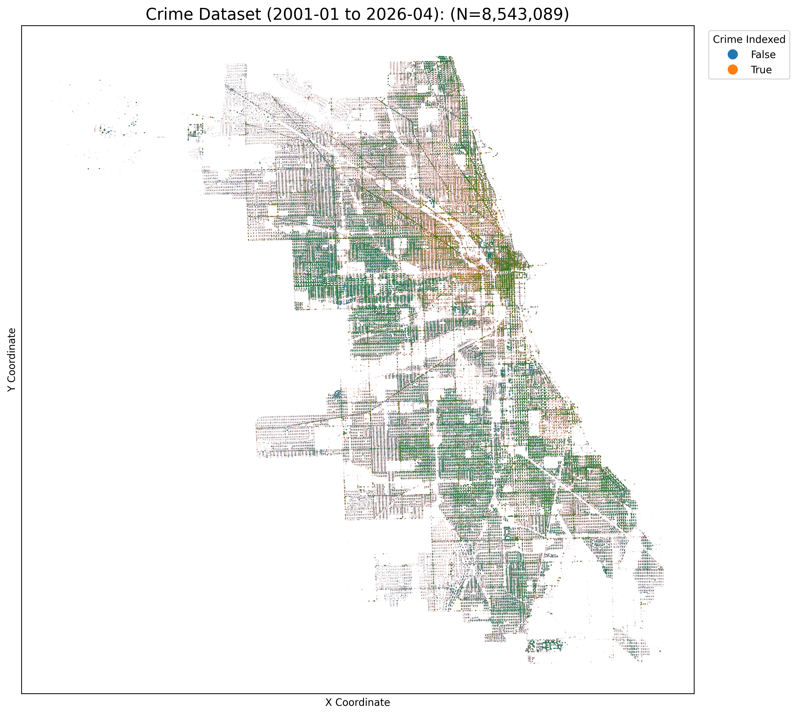
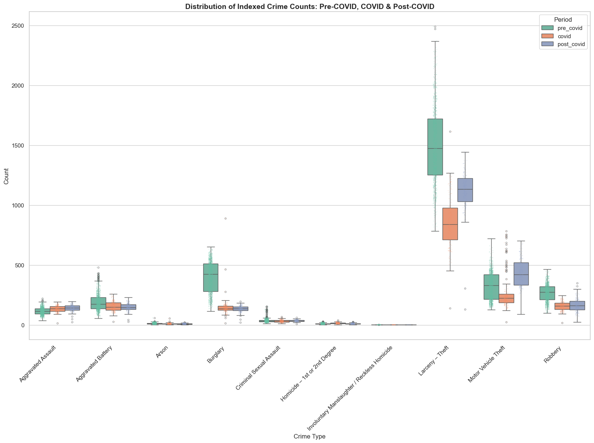
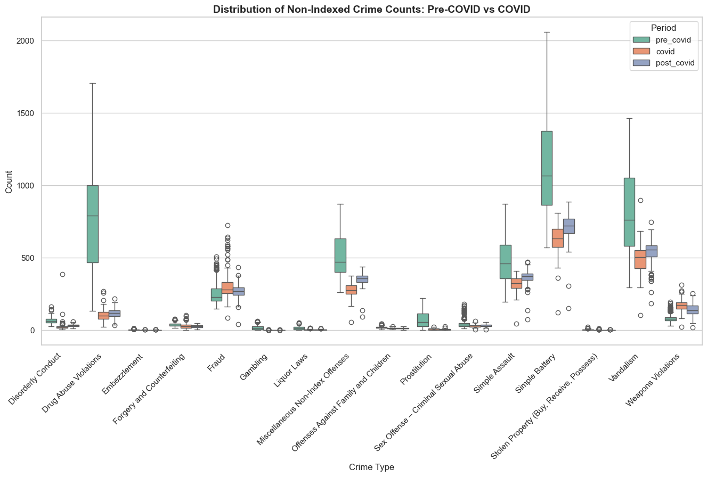

# Chicago Crime Analysis (2001 - 2025)

The data from the [Chicago Data Portal](https://data.cityofchicago.org/browse?category=Public+Safety&sortBy=most_accessed&page=1&pageSize=20) and the Crime dataset were enriched using multiple datasets from the portal. We initially stored them in a PostgreSQL database to generate the enriched dataset by joining multiple datasets using the_geom. However, we discovered inconsistencies in the police beat, district, and sector fields. All missing fields were determined using multiple fields to generate the most accurate information.

We designate the primary Crime dataset as the authoritative source of truth. To ensure consistency and address missing values, we perform internal imputation using data from other sources to fill corresponding NaN entries in location-based fields.

* [Data Wrangling Notebook](Notebook/ChicagoCrimeWrangle.ipynb)
* [Data Visualization Notebook](Notebook/ChicagoCrimeVisualize.ipynb)
* [Crime ERA Analysis Notebook](Notebook/ChicagoCrimeEraAnalysis.ipynb)
* [Cluster Analysis Notebook](Notebook/ChicagoCrimeExploratoryClusterAnalysis.ipynb)
* [Chicago Crime Composition Analysis](https://github.com/SirErikPak/ChicagoCrimeCompositionAnalysis)

## Chicago Crime Plot (2001 - 2025)

## Understanding Percentage of Crime (Pre‑COVID, COVID, and Post‑COVID)

## Summary

The dataset provides a fascinating look at how crime patterns shifted across the Pre-COVID, COVID, and Post-COVID eras. Looking at the raw counts and the percentage changes, a few clear narratives emerge regarding public safety and social behavior during these periods. The data tells a consistent story: while total volumes for traditional street crimes like Burglary or Drug Abuse dropped significantly, the composition of crime shifted toward more violent or high-impact categories like Weapons Violations and Motor Vehicle Theft.

### High-impact and violent crimes

The most jarring shifts occurred in weapons violations and motor vehicle theft. Even as many other crimes dropped, these categories saw significant growth from the Pre-COVID to the post-COVID eras.

* **Homicide (1st or 2nd Degree):** Rose +50.1% during COVID, but has since fully recovered to pre-COVID levels (pre vs. post: p=0.814, negligible effect size), making it the only violent crime to complete a full cycle.
* **Weapons Violations:** The most extreme sustained shift. Spiked +119.6% during COVID and remains +81.2% above the pre-COVID baseline post-COVID.
* **Motor Vehicle Theft:** Up +32.8% compared to the pre-COVID baseline, and still actively rising (one of only 4 crimes still in active transition).

### The "Lockdown" Effect (The Declines)

Crimes that generally require face-to-face interaction or people being out in public spaces saw massive drops, many of which have not returned to previous levels.

* **Drug Abuse Violations:** Dropped −83.6% from Pre-COVID to Post-COVID. This is consistent with reduced street-level enforcement during lockdowns, shifts in policing priorities, and decriminalization trends, though it should not be read as a drop in actual drug use.
* **Prostitution & Gambling:** Near-total collapses down 93.5% and 97.8% respectively, likely due to the closure of physical venues and shifts in police priorities.
* **Burglary:** Dropped −63.4% Pre → COVID. One plausible explanation is the shift to remote work, which makes residential targets riskier; this is a hypothesis, not a finding directly tested by the data.

### Fraud - the outlier

Fraud stands out as an outlier: it spiked significantly during COVID, with the exact Pre → Post figure visible in the chart. The surge aligns with pandemic-era scams and the rapid shift to digital transactions, though causation cannot be confirmed from this data alone.

### Composition of Crime

The shift in the nature of crime is best seen in the crime proportion columns. While Larceny–Theft remains the most common crime (roughly 21–23% of all records), other categories shifted the makeup of the city's crime profile. These two durable level shifts, the collapse of opportunity-driven crimes and the acceleration of violence-adjacent offenses, together represent a substantial reshaping of Chicago's reported crime profile, not merely a change in volume. Whether these shifts amount to a structural regime break is examined separately in ChicagoCrimeStructuralAnalysis, which uses compositional methods to test the discrete-shift hypothesis directly.

## Understanding Z-Scores and Crime Anomalies

Z-score analysis highlights specialized anomalies, places where a specific crime type is occurring at a rate far beyond what is statistically normal for the rest of the city.

* **Z-score of 3.0**: The value is higher than about 99.87% of all values in a normal distribution (extreme outlier)
* **Z-score of 2.0**: The value is higher than about 97.7% of all values (significantly higher than historical average)
* **Z-score of -1.0**: The value is lower than about 84% of all values (mild decrease)

## Interpreting the Clustering Heatmaps

### 1. The Color Intensity (The Values)

Since we are using Z-scores, look at the color first:

* **Deep Red**: The crime count for that specific year was significantly above its historical average
* **Deep Blue**: The crime count for that specific year was significantly below its historical average
* **White/Light Colors**: The crime count was "normal" or very close to the 25-year mean

### 2. The Dendrogram (The "Tree" Structure)

The branches on the top (or side) tell you how similar items are:

* **Close Neighbors**: If two crime types are connected by a short "U-shaped" branch, they have very similar patterns over the 25-year period
* **Branch Length**: The longer the vertical lines of the branch before they join, the less similar those two groups are

### 3. Reading the "Clusters" (The Groups)

* **The "Legacy" Cluster**: Crimes that were rampant in the early 2000s but have since crashed (like Drug Abuse Violations or Prostitution). These will be Red on the top-left and deep Blue on the bottom-right
* **The "Resilient" Cluster**: Crimes that have stayed consistently high or "Red" for almost the entire 25 years. These are the persistent issues Chicago faces
* **The "Modern Surge" Cluster**: Crimes that were blue for years but have recently turned bright Red (like Motor Vehicle Theft and Weapons Violations)

### 4. Reading the X and Y Axis Together

* **Vertical Red Streaks**: If you see a vertical column of red across many crimes for a single year (like 2020), it suggests an External Event (like the Pandemic or civil unrest) affected almost everything at once
* **Horizontal Red Streaks**: If one crime type is red across many years, it shows a long-term sustained increase for that specific category
* **Anomalies**: Look for a single "pop" of color that breaks a trend

### 5. Why the "Rotation" Helps

By rotating the plot, you can now scan horizontally to see which crimes behave similarly in the same year, and scan vertically to see how a single crime's "fortune" has changed from 2001 to 2025.

## Cluster Indexed Crime Analysis [Notebook](Notebook/ChicagoCrimeExploratoryClusterAnalysis.ipynb)

The two analyses are complementary: individual category levels shifted significantly (see the EraAnalysis notebook), but the underlying compositional structure evolved gradually rather than breaking discretely at the pandemic. *What crimes are reported* shifted measurably, while *how crime categories relate to one another* did not undergo a discrete break.

## Was COVID a Structural Break?

While many individual crime categories demonstrated significant changes across the pandemic boundary, an additional compositional analysis ([Structural Analysis notebook](https://github.com/SirErikPak/ChicagoCrimeCompositionAnalysis/blob/main/notebook/ChicagoCrimeStructuralAnalysis.ipynb)) examined whether the overall crime composition and its underlying co-movement structure underwent a systemic reorganization during the COVID period.

The answer is no. Four independent methods agree:

* **Multivariate changepoint detection (Pelt with BIC penalty)** returns zero breaks across penalty multipliers 0.5× to 4× and minimum-segment-lengths 12–36 months.
* **Confirmatory changepoint detection (Dynp at n=2)** places breaks at 2013-11 and 2019-09, while pre-pandemic dates are not aligned with COVID boundaries.
* **Univariate stationarity testing (Zivot-Andrews)** identifies only 3 of 24 categories with statistically significant single structural breaks; Liquor Laws breaks in 2015, five years before COVID.
* **Per-era dependence-structure comparison (Frobenius distance)** finds the post-COVID structure is *further* from pre-COVID than COVID itself was, indicating continued evolution rather than reversion to a pre-pandemic equilibrium.

### Summary (Indexed Crimes)

#### Correlation Distance + Complete Linkage on Z‑Scored Crime Time Series

This analysis examines how indexed crime categories in the dataset move over time by applying hierarchical clustering to **Z‑scored time series** using **correlation distance** and **complete linkage**. This configuration isolates **patterns of co‑movement**, allowing us to identify crime types that rise and fall together relative to their own historical baselines.

#### Key Insight

The resulting clusters do **not** reflect crime volume or severity. Instead, they reveal **synchronized temporal behavior**, crime types that tend to spike, dip, or shift together. These shared patterns often point to common underlying drivers such as environmental conditions, social dynamics, or policy changes.

#### Cluster Findings

##### Cluster 1: Lethal Violence

* Homicide - 1st or 2nd Degree
* Involuntary Manslaughter / Reckless Homicide
  * These offenses show tightly aligned anomaly patterns. When one deviates from its norm, the other typically does as well. This suggests shared situational or behavioral dynamics influencing lethal outcomes.

##### Cluster 2: Interpersonal Violence + Motor Vehicle Theft

* Aggravated Assault
* Criminal Sexual Assault
* Motor Vehicle Theft
  * Despite spanning both violent and property crime, these categories exhibit remarkably similar temporal rhythms. Their co‑movement suggests that broader social or environmental factors may be influencing both interpersonal violence and vehicle theft.

##### Cluster 3: Property Crime + Related Offenses

* Aggravated Battery
* Arson
* Burglary
* Larceny – Theft
* Robbery
  * This larger cluster reflects a group of offenses that share long‑term trends and seasonal patterns. Their synchronized behavior suggests they respond similarly to opportunity structures, economic conditions, or shifts in routine activity patterns.

#### Centroids Analysis

#### Insights & Observations

* **Cluster 1 (Lethal Violence)** stayed below average for nearly 15 years, hitting its lowest point around 2013. It surged starting in 2016, peaking in 2020, and shows a sharp downward trend toward 2025.

* **Cluster 2 (Interpersonal Violence + MVT)** started very strongly in the early 2000s but crashed hard between 2012 and 2015. It had a brief surge in the late 2010s but is currently drifting back into negative territory.

* **Cluster 3 (Property Crime + Related)** maintained high positive values for the first decade (2001–2011). Since 2014, it has been in long-term decline and has remained the lowest-performing group for several years.

* **Inverse Relationships:** Cluster 1 and Cluster 3 often move in opposite directions. In 2020, Cluster 1 reached a high of 1.62 while Cluster 3 reached a low of -0.91.

* **2024-2025 Pivot:** All three clusters are showing a downward trend as of 2025. Cluster 1, which was dominant during the pandemic years, has crashed back down to -0.105.

* **Volatility:** Cluster 1 shows the most dramatic swing, moving from deep negatives in the early 2010s to sharp positives in the early 2020s — a full arc no other cluster matches.

##### Conclusion

In calculating the mean Z-score path for each cluster, we revealed the group's underlying pulse. These centroids provide a clear visualization of the shared momentum within a cluster, helping distinguish long-term systemic shifts from short-term anomalies.

From a strategic perspective, these centroids serve as benchmarks for operational planning and resource allocation. Instead of managing dozens of individual crime categories, decision-makers can monitor a few primary centroid paths to identify which "temporal wave" a specific offense is riding. This simplifies the transition from data to action, as departments can align their long-term strategies with the specific lifecycle, whether a steady decline or a recent surge, which is both characterized by the cluster's central path.

Finally, centroid analysis enhances forecasting accuracy by providing a stable baseline for comparative assessment. By measuring the distance between a current crime trend and its assigned centroid, we can detect patterns that might precede a major shift in the criminal landscape. Ultimately, these centroids transform abstract statistical correlations into a manageable set of strategic profiles, enabling more precise interventions.
